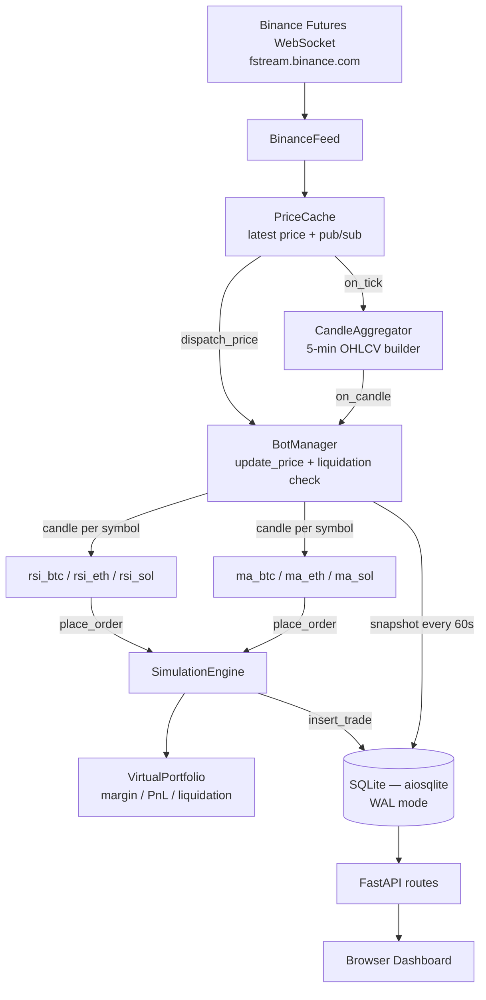

# Trade Platform — Architecture Overview

> **Purpose:** High-level reference for the project structure, components, and their connections.
> Detailed docs for each subsystem live in separate files in this directory.

---

## What This Project Is

A Python async crypto futures trading simulation platform that:
- Connects to **Binance Futures WebSocket** for live price data
- Runs **6 trading bots** (2 strategies × 3 coins) simultaneously in simulation
- Simulates **USDT-M perpetual futures** with 3× leverage, margin, and liquidation
- Provides a **FastAPI web dashboard** to monitor bots, trades, and portfolio in real-time
- Supports **backtesting** (with optional training/test date-range filtering) and **genetic parameter optimization** for each strategy
- Has an optional **LLM agent** (OpenAI) that periodically adjusts bot parameters

---

## Project Structure

```
trade_platform/
├── main.py                        # App entrypoint — wires all components
├── config.py                      # Settings via pydantic-settings / .env
├── requirements.txt
│
├── core/                          # Engine layer — no HTTP, no DB imports in strategies
│   ├── base_strategy.py           # Abstract BaseStrategy + shared order helpers
│   ├── bot_manager.py             # Bot lifecycle, candle dispatch, snapshot loop
│   ├── simulation_engine.py       # BaseOrderEngine + SimulationEngine (fake exchange)
│   ├── virtual_portfolio.py       # FuturesPosition, margin, liquidation, P&L
│   ├── backtest_engine.py         # Historical candle replay + metrics
│   ├── optimizer.py               # Genetic algorithm param optimizer
│   ├── llm_agent.py               # OpenAI periodic decision agent
│   └── utils.py                   # safe_float / safe_round helpers
│
├── data/                          # Market data ingestion
│   ├── binance_feed.py            # Binance Futures WebSocket aggTrade stream
│   ├── price_cache.py             # In-memory latest price + pub/sub
│   ├── candle_aggregator.py       # Builds 5-min OHLCV candles from ticks
│   └── historical.py             # REST download of historical klines
│
├── strategies/                    # Signal logic only — no DB, no HTTP
│   ├── __init__.py                # Exports active strategy classes
│   ├── example_rsi_bot.py         # Wilder RSI + EMA trend filter
│   └── example_ma_crossover.py    # MACD crossover + histogram filter
│
├── db/                            # Persistence layer
│   ├── database.py                # aiosqlite connection, WAL mode, migrations
│   ├── models.py                  # Dataclasses: BotRecord, TradeRecord, PortfolioSnapshot
│   └── repository.py              # All SQL queries (no raw SQL outside this file)
│
├── api/                           # HTTP layer
│   ├── routes/
│   │   ├── bots.py                # GET/POST /api/bots — list, start, stop, params
│   │   ├── portfolio.py           # GET /api/portfolio — balances, positions
│   │   ├── trades.py              # GET /api/trades — trade history
│   │   ├── backtest.py            # POST /api/backtest/run, /optimize
│   │   ├── llm.py                 # GET /api/llm — agent status, log
│   │   └── logs.py                # GET /api/logs — in-memory WARNING+ buffer
│   └── static/
│       ├── index.html             # Dashboard SPA
│       ├── app.js                 # Fetch + render logic
│       └── style.css
│
├── scripts/
│   └── collect_orderbook.py       # Standalone OB snapshot collector (runs separately)
│
└── plans/
    └── architecture.md            # This file
```

---

## Live Data Flow



---

## Bots (2 strategies × 3 coins = 6 instances)

| Bot name pattern | Strategy file | Signal type |
|---|---|---|
| `rsi_btc/eth/sol` | `example_rsi_bot.py` | Wilder RSI + EMA(50) trend filter |
| `ma_btc/eth/sol` | `example_ma_crossover.py` | MACD crossover + histogram momentum |

Each bot is a dynamically-created subclass via `BaseStrategy.for_symbol(symbol)`:
```python
RSIBot.for_symbol("BTCUSDT")  # → class RSIBot_BTC with name="rsi_btc", symbol="BTCUSDT"
```

---

## Core Components

### `BaseStrategy` — `core/base_strategy.py`

Abstract base for all bots. Provides:
- `PARAM_SCHEMA` — declares tunable parameters with type, default, min, max
- `get_params()` / `set_params()` — runtime parameter editing (persisted to DB)
- `for_symbol(symbol)` — factory classmethod, creates a named subclass per coin
- `_open_position(price, side)` / `_close_position(price, side, reason)` — shared order helpers
- `_candle_count` / `_last_trade_candle` — shared candle counter and cooldown state
- `on_candle(candle)` — abstract; each strategy implements its signal logic here

**Layer rule:** Strategies must NOT import from `db` or `api`. They only know about `self.engine`.

---

### `SimulationEngine` — `core/simulation_engine.py`

Implements `BaseOrderEngine` (the fake exchange). Responsibilities:
- `place_order(bot_id, symbol, side, quantity, price)` — routes BUY/SELL to open/close long/short
- `update_price(symbol, price)` — updates tick price, triggers liquidation checks
- `update_orderbook(symbol, snapshot)` — stores OB snapshot for VWAP fill price simulation
- `get_orderbook_snapshot(symbol)` — returns latest OB data (used by strategies via engine)
- `get_portfolio(bot_id)` / `reset_portfolio(bot_id)` — public portfolio access
- `save_snapshot(bot_id)` — persists portfolio state to DB
- `skip_db: bool = False` constructor flag — set `True` in backtest to avoid DB writes

**Future:** Swap `SimulationEngine` → `LiveBinanceEngine` (same interface) to go live. Strategies never change.

---

### `VirtualPortfolio` — `core/virtual_portfolio.py`

Tracks per-bot futures state:
- `FuturesPosition` dataclass: side (LONG/SHORT/NONE), qty, entry price, leverage, margin, liquidation price
- `open_long / open_short / close_long / close_short` — position transitions
- `check_liquidation(price)` — called on every price tick; forced close + margin loss on trigger
- `deduct_fee(fee_usdt)` — guarded to prevent negative balance
- `get_state(current_price)` — full snapshot dict for API/DB

**Note:** Liquidation uses tick prices (not mark price). This is more aggressive than a real exchange but simpler to implement — documented in code.

---

### `BotManager` — `core/bot_manager.py`

Orchestrates all bots:
- `register(bot_class)` — instantiates bot, loads saved params, creates portfolio
- `start_bot / stop_bot / start_all / stop_all` — asyncio.Task lifecycle
- `dispatch_price(symbol, price)` — calls `engine.update_price` + per-bot `on_price_update`
- `dispatch_candle(candle)` — puts candle into each matching bot's queue
- `_candle_loop(bot)` — reads from bot's candle queue, calls `bot.on_candle()`
- `_snapshot_loop(bot_id)` — saves portfolio snapshots every N seconds with random jitter (prevents DB lock bursts)
- `_orderbook_refresh_loop` — periodically loads OB data from DB into engine
- `_restore_balance_from_snapshot` — on startup, restores bot state from last DB snapshot

---

### `CandleAggregator` — `data/candle_aggregator.py`

Converts raw price ticks → 5-minute OHLCV candles:
- `on_tick(symbol, price)` — updates in-progress candle; emits completed candle at 5-min boundary
- `flush()` — emits any partial in-progress candle (called on shutdown)
- `subscribe / unsubscribe` — pub/sub for candle callbacks

---

### Backtest & Optimizer — `core/backtest_engine.py`, `core/optimizer.py`

- `run_backtest(bot_id, symbol, strategy_class, params, start_ms, end_ms)` — replays DB historical 5m candles through a fresh `SimulationEngine(skip_db=True)` instance; optional `start_ms`/`end_ms` filter enables running on a held-out test window vs the full training set; Sharpe annualized using 105,120 candles/year (288 × 365)
- `optimize_params(...)` — genetic algorithm (tournament select, BLX-α crossover, adaptive mutation, elitism); runs many backtests in parallel; returns best params found

---

### LLM Agent — `core/llm_agent.py`

Optional periodic OpenAI agent (off by default, enable via `LLM_ENABLED=true`):
- Reads `app.state.bot_manager` and `app.state.engine` (no module-level globals)
- Collects all bot states, recent trades, current params → builds prompt
- Calls OpenAI → parses JSON response with `actions` list
- Applies `set_params / start_bot / stop_bot` via BotManager
- Logs decisions to `llm_decisions` DB table

---

## Dependency Injection Pattern

All API routes and the LLM agent access shared singletons via `app.state`:

```python
# main.py (lifespan startup)
app.state.bot_manager = bot_manager
app.state.engine = simulation_engine
app.state.symbols = SYMBOLS

# api/routes/bots.py
def _get_manager(request: Request):
    return getattr(request.app.state, "bot_manager", None)
```

No module-level globals with `set_xxx()` injection.

---

## Database Schema

**SQLite** via `aiosqlite`, WAL mode. All timestamps stored as `ISO 8601 UTC` with `+00:00` suffix.

| Table | Key columns | Purpose |
|---|---|---|
| `bots` | `id TEXT PK, symbol, status, initial_balance` | Bot registry |
| `trades` | `bot_id FK, side, symbol, quantity, price, realized_pnl, fee_usdt, position_side, timestamp` | Trade history |
| `portfolio_snapshots` | `bot_id FK, usdt_balance, asset_balance, total_value_usdt, asset_price, timestamp` | Historical equity curve |
| `bot_params` | `bot_id PK, params_json, updated_at` | Persisted parameter overrides |
| `llm_decisions` | `timestamp, prompt_summary, response_json, actions_taken, success` | LLM agent log |
| `historical_candles` | `symbol, open_time PK, open/high/low/close/volume, close_time` | Klines for backtest |
| `orderbook_snapshots` | `symbol, timestamp, bids_json, asks_json, metrics…` | OB data for backtest + OB bots |

---

## API Endpoints

| Method | Path | Purpose |
|---|---|---|
| `GET` | `/api/bots` | List all bots with status and stats |
| `GET` | `/api/bots/{name}` | Single bot detail |
| `POST` | `/api/bots/{name}/start` | Start a bot |
| `POST` | `/api/bots/{name}/stop` | Stop a bot |
| `POST` | `/api/bots/{name}/reset` | Reset portfolio to initial balance |
| `POST` | `/api/bots/reset-all` | Reset all bots |
| `GET` | `/api/bots/{name}/params` | Get param schema + current values |
| `PUT` | `/api/bots/{name}/params` | Update params (validated, persisted) |
| `GET` | `/api/portfolio/all` | All bot portfolio states |
| `GET` | `/api/portfolio/{name}` | Single bot futures portfolio state |
| `GET` | `/api/portfolio/{name}/history` | Portfolio snapshot history (for charting) |
| `GET` | `/api/portfolio/coin-positions` | Aggregate position view per symbol |
| `GET` | `/api/portfolio/orderbook/{symbol}` | Latest OB snapshot |
| `GET` | `/api/trades/{bot_name}` | Paginated trade history for a bot |
| `GET` | `/api/trades/{bot_name}/stats` | Aggregated trade stats for a time window |
| `POST` | `/api/backtest/download` | Download 5m klines from Binance (`days` up to 180, optional `start_date` for test window) |
| `GET` | `/api/backtest/data-status` | Available historical data |
| `POST` | `/api/backtest/run` | Run a backtest (optional `start_date`/`end_date` for training vs test split) |
| `POST` | `/api/backtest/optimize` | Start genetic optimization (async, background) |
| `GET` | `/api/backtest/status` | Poll backtest/optimization task status |
| `GET` | `/api/llm/status` | LLM agent status + last decision |
| `GET` | `/api/llm/log` | Recent LLM decisions (newest first) |
| `POST` | `/api/llm/trigger` | Manually trigger one LLM decision cycle |
| `POST` | `/api/llm/enable` | Enable the agent at runtime |
| `POST` | `/api/llm/disable` | Disable the agent at runtime |
| `GET` | `/api/logs` | Recent WARNING+ log lines |
| `GET` | `/health` | Liveness check |
| `GET` | `/` | Dashboard HTML |

---

## Configuration — `config.py`

Key settings (all from `.env` or environment variables):

| Setting | Default | Purpose |
|---|---|---|
| `trading_mode` | `simulation` | `simulation` only (live = future) |
| `leverage` | `3` | Futures leverage multiplier |
| `simulation_fee_rate` | `0.0005` | 0.05% taker fee per order |
| `initial_usdt_balance` | `10000` | Starting USDT per bot |
| `snapshot_interval_seconds` | `60` | Portfolio snapshot frequency |
| `base_slippage_pct` | `0.02` | Fallback slippage when no OB data |
| `max_slippage_pct` | `0.10` | Order rejection threshold |
| `llm_enabled` | `false` | Enable OpenAI agent |
| `llm_api_key` | `""` | OpenAI API key |
| `llm_interval_minutes` | `10` | Minutes between LLM calls |
| `db_path` | `trade_platform.db` | SQLite file path |

---

## External Scripts

**`scripts/collect_orderbook.py`** — runs as a **separate process** (systemd service), connects to Binance and writes order-book snapshots to the same SQLite DB every 60 seconds. Both it and the main app use WAL mode + `busy_timeout`. The main app's snapshot loops use random jitter to avoid write collisions.

---

## Async Architecture

Everything runs in a single `asyncio` event loop managed by `uvicorn`:

```
asyncio event loop
  ├── uvicorn (FastAPI HTTP)
  ├── binance-feed task (WebSocket)
  ├── llm-agent task (optional)
  └── per-bot tasks (12×):
        ├── candle_loop
        ├── snapshot_loop (jittered start)
        └── orderbook_refresh_loop (shared, one per symbol group)
```

App startup/shutdown is managed by FastAPI `lifespan` context manager in `main.py`.

---

## Migration Path: Simulation → Live

```python
class BaseOrderEngine(ABC):
    async def place_order(self, bot_id, symbol, side, quantity, price) -> dict: ...
    async def get_balance(self, bot_id, asset) -> float: ...
    async def get_portfolio_state(self, bot_id) -> dict: ...
    async def get_orderbook_snapshot(self, symbol) -> dict | None: ...
```

| Component | Simulation | Live (future) |
|---|---|---|
| Order execution | `SimulationEngine` | `LiveBinanceEngine` |
| Balance | `VirtualPortfolio` | Binance account via REST |
| Strategies | Unchanged | Unchanged |
| Data feed | Unchanged | Unchanged |
| DB | Unchanged | Unchanged |

To go live: implement `LiveBinanceEngine(BaseOrderEngine)` and swap it in `main.py`. Strategies, BotManager, and all API routes never change.
