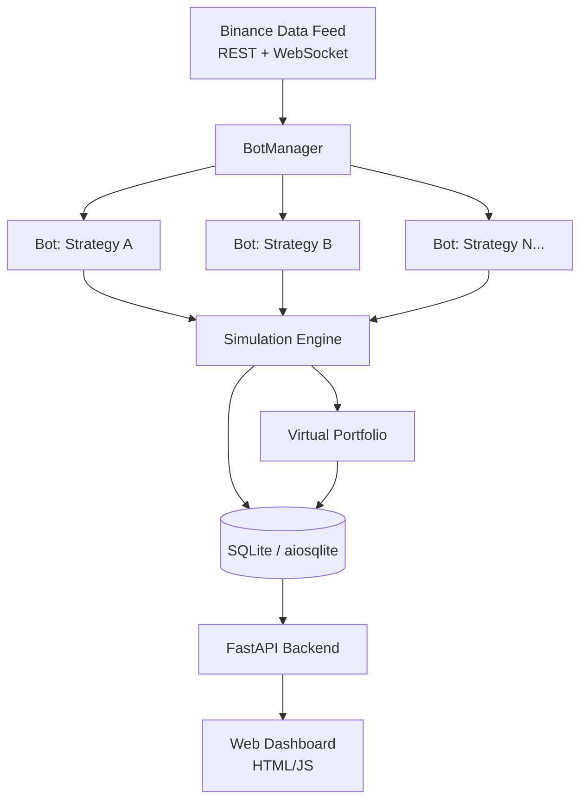
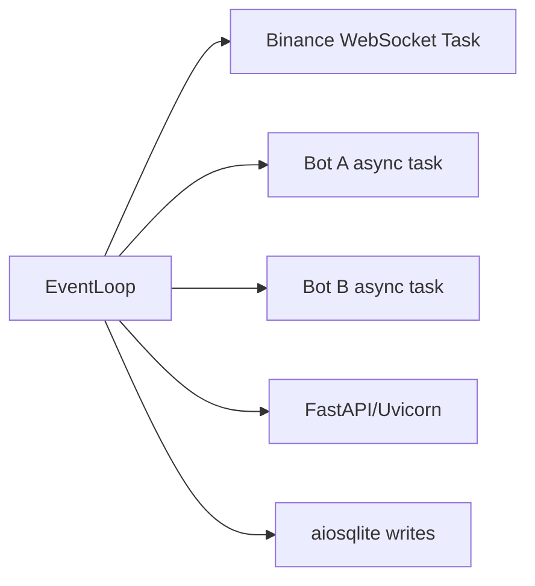

# Crypto Trading Platform — Architecture Plan

## Overview

A Python-based crypto trading platform that:
- Connects to Binance API for live price data
- Runs multiple trading bots (strategies) simultaneously
- Simulates trading with virtual portfolio (no real money)
- Provides a FastAPI web dashboard to monitor bots and trades
- Is designed to be extended to live trading in the future

---

## System Architecture



---

## Project Directory Structure

```
trade_platform/
├── main.py                        # App entrypoint, starts all services
├── config.py                      # Global config (API keys, symbols, settings)
├── requirements.txt
│
├── core/
│   ├── __init__.py
│   ├── base_strategy.py           # Abstract BaseStrategy class
│   ├── bot_manager.py             # Runs/stops bots, manages lifecycle
│   ├── simulation_engine.py       # Routes orders through virtual portfolio
│   └── virtual_portfolio.py       # Tracks balances, open positions, P&L
│
├── data/
│   ├── __init__.py
│   ├── binance_feed.py            # Binance WebSocket + REST price feed
│   └── price_cache.py             # In-memory latest price cache
│
├── strategies/
│   ├── __init__.py
│   ├── example_rsi_bot.py         # Example: RSI-based strategy
│   └── example_ma_crossover.py    # Example: Moving average crossover
│
├── db/
│   ├── __init__.py
│   ├── database.py                # aiosqlite connection + init
│   ├── models.py                  # Table schemas as dataclasses/TypedDicts
│   └── repository.py              # DB queries (insert trade, get history, etc.)
│
├── api/
│   ├── __init__.py
│   ├── server.py                  # FastAPI app
│   ├── routes/
│   │   ├── bots.py                # GET/POST /bots — list, start, stop bots
│   │   ├── trades.py              # GET /trades — trade history per bot
│   │   └── portfolio.py           # GET /portfolio — current balances, P&L
│   └── static/
│       ├── index.html             # Dashboard HTML
│       └── app.js                 # Minimal JS for fetching data
│
└── plans/
    └── architecture.md            # This file
```

---

## Core Components

### 1. `BaseStrategy` (Abstract Class)

Every trading bot inherits from this. It enforces a consistent interface so new bots can be added without touching the rest of the system.

```python
# core/base_strategy.py
class BaseStrategy(ABC):
    name: str                        # Unique identifier for the bot
    symbol: str                      # e.g. "BTCUSDT"
    is_running: bool

    async def on_price_update(self, price: float) -> None: ...
    async def start(self) -> None: ...
    async def stop(self) -> None: ...
    async def get_stats(self) -> dict: ...
```

To **add a new bot**: create a file in `strategies/`, subclass `BaseStrategy`, implement `on_price_update()`, and register it in `config.py`. Nothing else changes.

---

### 2. `BotManager`

- Holds a registry of all active bots
- Starts/stops them as async tasks (`asyncio.Task`)
- Exposes an API for the dashboard to list, start, and stop bots at runtime

---

### 3. `SimulationEngine`

Acts as a **fake exchange**. When a bot calls `engine.place_order(side, quantity, price)`, the engine:
1. Validates the order against the virtual portfolio balance
2. Records the trade in the DB
3. Updates the virtual portfolio

This layer is the **key abstraction** for future live trading: replace `SimulationEngine` with `LiveBinanceEngine` that calls real Binance order endpoints, and the bots themselves don't need to change at all.

---

### 4. `VirtualPortfolio`

Tracks:
- Base currency balance (e.g. USDT)
- Asset holdings per symbol
- Open positions
- Realized and unrealized P&L
- Snapshots saved to DB periodically for historical charting

---

### 5. Binance Data Feed

- **WebSocket** stream for real-time tick prices (low latency)
- **REST API** for historical candles (for bots that need indicators like RSI/MA)
- `PriceCache` stores the latest price per symbol in memory, broadcast to all subscribed bots

Library: `python-binance` or raw `websockets` + `httpx`

---

### 6. Database Schema (SQLite via `aiosqlite`)

**Table: `bots`**
| Column | Type | Notes |
|---|---|---|
| id | TEXT | strategy name as PK |
| symbol | TEXT | e.g. BTCUSDT |
| status | TEXT | running / stopped |
| created_at | DATETIME | |

**Table: `trades`**
| Column | Type | Notes |
|---|---|---|
| id | INTEGER PK | |
| bot_id | TEXT FK | |
| side | TEXT | BUY / SELL |
| symbol | TEXT | |
| quantity | REAL | |
| price | REAL | |
| timestamp | DATETIME | |
| pnl | REAL | realized P&L on SELL |

**Table: `portfolio_snapshots`**
| Column | Type | Notes |
|---|---|---|
| id | INTEGER PK | |
| bot_id | TEXT FK | |
| usdt_balance | REAL | |
| asset_balance | REAL | |
| total_value_usdt | REAL | |
| timestamp | DATETIME | |

---

### 7. FastAPI Dashboard

**Endpoints:**
- `GET /api/bots` — list all bots and their status
- `POST /api/bots/{name}/start` — start a bot
- `POST /api/bots/{name}/stop` — stop a bot
- `GET /api/bots/{name}/trades` — trade history for a bot
- `GET /api/bots/{name}/portfolio` — portfolio snapshots
- `GET /` — serves the HTML dashboard

**Dashboard shows:**
- List of bots with start/stop controls
- Current virtual balance per bot
- Trade history table
- Simple P&L over time (using portfolio snapshots)

---

## Async Architecture

Everything runs in a single `asyncio` event loop:



`main.py` starts `uvicorn` with `asyncio.run()`, and the `BotManager` and `BinanceFeed` are started as background tasks on app startup via FastAPI `lifespan` events.

---

## Migration Path: Simulation → Live Trading

The simulation engine and live engine share the same interface:

```python
class BaseOrderEngine(ABC):
    async def place_order(self, bot_id, symbol, side, quantity, price) -> Trade: ...
    async def get_balance(self, asset: str) -> float: ...
```

| Component | Simulation Mode | Live Mode |
|---|---|---|
| Order execution | `SimulationEngine` (math only) | `LiveBinanceEngine` (calls Binance API) |
| Balance | `VirtualPortfolio` | Real Binance account via API |
| Strategy bots | Unchanged | Unchanged |
| Data feed | Unchanged | Unchanged |

To go live: swap `SimulationEngine` → `LiveBinanceEngine` in `config.py`. Bots never know the difference.

---

## Key Libraries

| Library | Purpose |
|---|---|
| `fastapi` | Web API + dashboard serving |
| `uvicorn` | ASGI server |
| `aiosqlite` | Async SQLite |
| `websockets` | Binance WebSocket feed |
| `httpx` | Async REST calls to Binance |
| `python-binance` | Optional: full Binance SDK |
| `pandas` / `numpy` | Indicator calculations in strategies |
| `pydantic` | Data validation in API layer |

---

## Implementation Phases

### Phase 1 — Core Foundation
- Project scaffold + `config.py`
- `BaseStrategy` abstract class
- `VirtualPortfolio` + `SimulationEngine`
- `aiosqlite` DB setup with schema migrations
- `BotManager` with asyncio task management

### Phase 2 — Binance Integration
- Binance WebSocket price feed
- `PriceCache` and subscription model
- REST candle fetching for indicator-based strategies

### Phase 3 — Example Bots
- `ExampleRSIBot` (RSI overbought/oversold)
- `ExampleMACrossoverBot` (fast/slow MA crossover)

### Phase 4 — FastAPI Dashboard
- API routes for bots, trades, portfolio
- Basic HTML dashboard with auto-refresh

### Phase 5 — Future: Live Trading
- `LiveBinanceEngine` implementing `BaseOrderEngine`
- Config flag to switch simulation/live mode
- Risk management layer (max position size, stop-loss)
