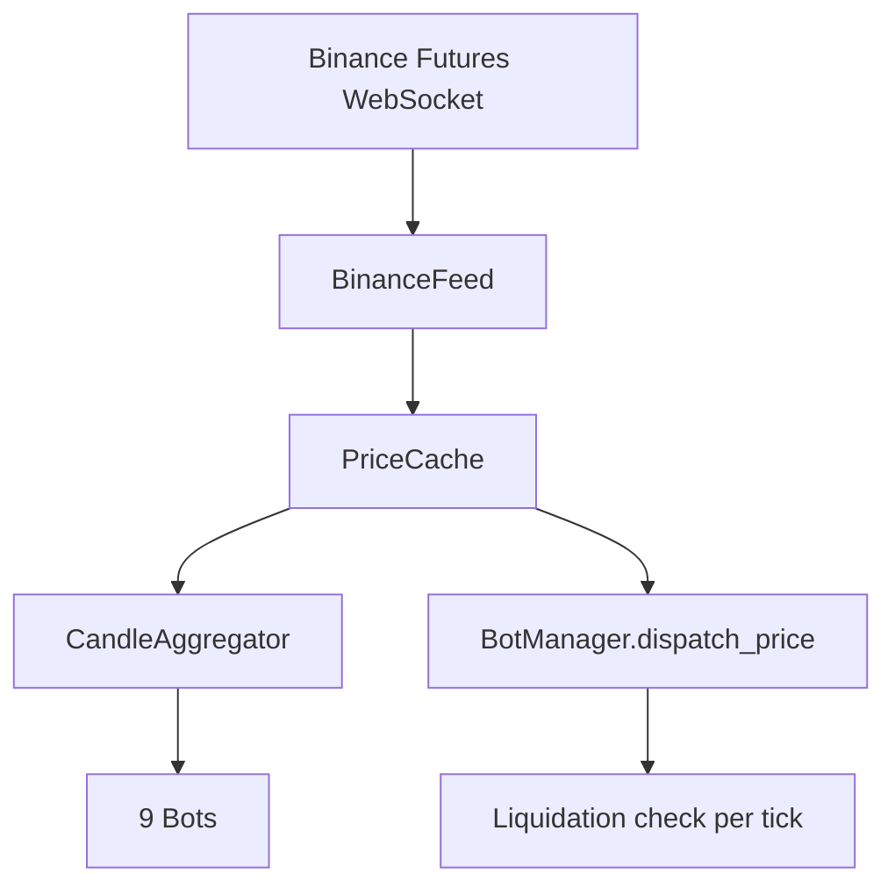

# Futures Migration Plan — Spot → USDT-M Futures Simulation

## Overview

Switch all 9 bots from spot trading to **USDT-Margined perpetual futures** simulation. This enables:
- **SHORT positions** — profit from price drops, not just rises
- **Leverage** — amplify returns with margin-based trading
- **Lower fees** — Binance Futures: 0.02% maker / 0.05% taker vs 0.10% spot
- **Bidirectional strategies** — every indicator signal can generate a trade in both directions

## Key Differences: Spot vs Futures

| Concept | Spot | Futures |
|---------|------|---------|
| Directions | LONG only (buy low, sell high) | LONG + SHORT |
| Capital needed | Full position value | Margin = value / leverage |
| Leverage | 1x fixed | Configurable (we use 3x) |
| Liquidation | Cannot happen | When loss >= margin |
| Fees | 0.10% per trade | 0.02-0.05% per trade |
| Data feed | `stream.binance.com` | `fstream.binance.com` |
| P&L (LONG) | (exit - entry) × qty | (exit - entry) × qty × leverage |
| P&L (SHORT) | impossible | (entry - exit) × qty × leverage |

---

## Architecture Changes

### Simplified Order API

Strategies keep using `place_order(side="BUY"/"SELL")`. The engine interprets based on current position:

| Current Position | BUY | SELL |
|-----------------|-----|------|
| No position | Open LONG | Open SHORT |
| LONG | Error (already long) | Close LONG |
| SHORT | Close SHORT | Error (already short) |

This is the most natural API — strategies just say "I want to go long" (BUY) or "I want to go short" (SELL). The engine handles margin, leverage, and PnL automatically.

### Data Flow (unchanged except WebSocket URL)



---

## 1. Config Changes — `config.py`

```python
# Fee: Binance Futures taker fee (we always market-order in sim)
simulation_fee_rate: float = 0.0005  # 0.05% per trade

# Leverage: position multiplier
leverage: int = 3  # 3x leverage — conservative, liquidation at ~33% move

# Margin mode
margin_mode: str = "isolated"  # "isolated" (per-position) or "cross" (shared)
```

**Why 3x leverage**: At 3x, liquidation happens at ~33% adverse price move. BTC/ETH rarely move 33% in a few hours. At 10x, liquidation is at ~10%, which can happen in volatile sessions. 3x is a good balance of amplified returns without frequent liquidations.

---

## 2. VirtualPortfolio Rewrite — `core/virtual_portfolio.py`

### Position Dataclass

```python
@dataclass
class FuturesPosition:
    symbol: str
    side: str = "NONE"         # "LONG", "SHORT", "NONE"
    quantity: float = 0.0       # position size in asset units
    entry_price: float = 0.0    # average entry price
    leverage: int = 1           # leverage multiplier
    margin: float = 0.0         # USDT collateral locked for this position
    liquidation_price: float = 0.0  # price at which position is liquidated
```

### Key Methods

**`open_long(quantity, price, leverage)`**:
1. Calculate notional = quantity × price
2. Calculate margin = notional / leverage
3. Deduct margin from USDT balance
4. Set position: side=LONG, entry=price, margin locked
5. Calculate liquidation price: `entry × (1 - 1/leverage + fee_buffer)`
   - At 3x: liquidation ~= entry × 0.67 (33% drop)

**`close_long(quantity, price)`**:
1. Calculate PnL = (price - entry) × quantity
2. Return margin + PnL to USDT balance (if PnL > -margin)
3. Clear position

**`open_short(quantity, price, leverage)`**:
1. Same margin calculation
2. Set position: side=SHORT
3. Liquidation price: `entry × (1 + 1/leverage - fee_buffer)`
   - At 3x: liquidation ~= entry × 1.33 (33% rise)

**`close_short(quantity, price)`**:
1. Calculate PnL = (entry - price) × quantity (profit when price drops)
2. Return margin + PnL to USDT balance
3. Clear position

**`check_liquidation(current_price)`** — called on every tick:
- LONG: if current_price <= liquidation_price → force close, lose all margin
- SHORT: if current_price >= liquidation_price → force close, lose all margin
- Log liquidation event, reset position

### `get_state()` additions
```python
{
    # Existing fields...
    "position_side": "LONG" | "SHORT" | "NONE",
    "leverage": 3,
    "margin_locked": 150.00,
    "liquidation_price": 53000.00,
    "unrealized_pnl": -12.50,
    "margin_ratio": 0.85,  # how close to liquidation (1.0 = liquidated)
}
```

### `total_value_usdt` calculation
```
total_value = usdt_balance + margin_locked + unrealized_pnl
```
Where:
- `usdt_balance` = free USDT (not locked in positions)
- `margin_locked` = collateral locked in open position
- `unrealized_pnl` = current profit/loss on open position

---

## 3. SimulationEngine Changes — `core/simulation_engine.py`

### `place_order()` routing

```python
async def place_order(self, bot_id, symbol, side, quantity, price):
    portfolio = self._get_portfolio(bot_id)
    position = portfolio.position

    if side == "BUY":
        if position.side == "NONE":
            result = portfolio.open_long(quantity, price)
        elif position.side == "SHORT":
            result = portfolio.close_short(quantity, price)
        else:
            raise ValueError("Already in LONG position")

    elif side == "SELL":
        if position.side == "NONE":
            result = portfolio.open_short(quantity, price)
        elif position.side == "LONG":
            result = portfolio.close_long(quantity, price)
        else:
            raise ValueError("Already in SHORT position")
```

### Liquidation on price update

```python
def update_price(self, symbol, price):
    self._prices[symbol] = price
    # Check liquidation for all portfolios trading this symbol
    for portfolio in self._portfolios.values():
        if portfolio.symbol == symbol:
            liquidated = portfolio.check_liquidation(price)
            if liquidated:
                logger.warning(f"LIQUIDATED: {portfolio.bot_id} at {price}")
```

### `get_balance()` changes

```python
async def get_balance(self, bot_id, asset):
    if asset == "USDT":
        return portfolio.usdt_balance  # free USDT only
    if asset == portfolio.asset_symbol:
        return portfolio.position.quantity  # position size
    if asset == "POSITION":
        return portfolio.position.side  # "LONG", "SHORT", "NONE"
```

Strategies can query position state to decide whether to BUY or SELL.

---

## 4. Strategy Changes — All 3 Bots

### Universal Pattern (replaces spot buy/sell)

```python
# Old spot logic:
if signal_buy and not self._in_position:
    await self._buy(price)
elif signal_sell and self._in_position:
    await self._sell(price)

# New futures logic:
position = await self.engine.get_balance(self.name, "POSITION")
if signal_buy and position != "LONG":
    if position == "SHORT":
        await self._close(price)     # close short first
    await self._open_long(price)
elif signal_sell and position != "SHORT":
    if position == "LONG":
        await self._close(price)     # close long first
    await self._open_short(price)
```

### RSI Bot — Bidirectional Mean Reversion
- RSI < 30 → **OPEN LONG** (oversold, expect bounce up)
- RSI > 70 → **OPEN SHORT** (overbought, expect drop)
- If already in opposite position, close it first then open new one
- **Double the signal count** vs spot (every overbought IS a signal now, not just an exit)

### MACD Bot — Bidirectional Trend Following
- Bullish crossover (MACD > Signal, MACD > 0) → **OPEN LONG**
- Bearish crossover (MACD < Signal, MACD < 0) → **OPEN SHORT**
- Close previous position + open new direction on each crossover

### Bollinger Bot — Bidirectional Mean Reversion
- Close < lower band → **OPEN LONG** (expect reversion to upper band)
- Close > upper band → **OPEN SHORT** (expect reversion to lower band)
- Take profit at opposite band
- Stop-loss at 1% from entry (or liquidation, whichever comes first)

---

## 5. Data Feed — `data/binance_feed.py`

Change WebSocket URL from spot to futures:

```python
# Old (spot):
BINANCE_WS_BASE = "wss://stream.binance.com:9443/stream"

# New (futures):
BINANCE_WS_BASE = "wss://fstream.binance.com/stream"
```

The aggTrade stream format is identical between spot and futures — same JSON structure, same `s` (symbol) and `p` (price) fields. Zero parsing changes needed.

**Note**: Futures prices can differ slightly from spot prices (basis), but for simulation purposes the price feed is effectively the same.

---

## 6. Database / API / Dashboard

### DB Models — `db/models.py`
Add `position_side` to TradeRecord:
```python
@dataclass
class TradeRecord:
    # ... existing fields ...
    position_side: str = "LONG"  # "LONG" or "SHORT"
```

### DB Schema — `db/database.py`
Additive migration: `ALTER TABLE trades ADD COLUMN position_side TEXT DEFAULT 'LONG'`

### API — `api/routes/portfolio.py`
Add futures fields to portfolio response: `position_side`, `leverage`, `margin_locked`, `liquidation_price`, `margin_ratio`

### Dashboard — `api/static/index.html`
- Show position side (LONG/SHORT/NONE) with color coding (green/red/gray)
- Show leverage badge (3x)
- Show liquidation price
- Show margin ratio as a progress bar (warning when > 80%)

---

## 7. Files to Modify

| File | Changes |
|------|---------|
| `config.py` | Add `leverage`, `margin_mode`; lower `simulation_fee_rate` to 0.0005 |
| `core/virtual_portfolio.py` | **Rewrite**: FuturesPosition, open/close long/short, liquidation, margin |
| `core/simulation_engine.py` | Route BUY/SELL to open/close, liquidation on price update |
| `data/binance_feed.py` | Change WebSocket URL to futures endpoint |
| `strategies/example_rsi_bot.py` | Add SHORT logic: overbought → open short |
| `strategies/example_ma_crossover.py` | Add SHORT logic: bearish crossover → open short |
| `strategies/bollinger_bot.py` | Add SHORT logic: upper band → open short |
| `db/models.py` | Add `position_side` to TradeRecord |
| `db/database.py` | Additive migration for `position_side` column |
| `api/routes/portfolio.py` | Add futures fields to response |
| `api/static/index.html` | Show position side, leverage, liquidation, margin |
| `main.py` | No changes needed (bot registration unchanged) |

---

## 8. Why This Makes All Strategies Better

With spot, our bots could only profit in uptrends. With futures:

| Market Condition | Spot Bots | Futures Bots |
|-----------------|-----------|--------------|
| Price going up | ✅ LONG profits | ✅ LONG profits (3x amplified) |
| Price going down | ❌ Just waiting | ✅ SHORT profits (3x amplified) |
| Sideways/choppy | ❌ Losing to fees | ✅ Mean reversion both ways |

The Bollinger bot especially benefits — it can profit from BOTH touches of the bands, not just the lower one.

---

## 9. Risk Management

- **Max leverage**: 3x (configurable, but 3x is recommended for safety)
- **Liquidation logging**: Prominent warning in logs when liquidation occurs
- **Dashboard warning**: Red banner when margin ratio > 80%
- **Position size**: Still using `TRADE_FRACTION = 0.80` — the margin for that is only `0.80 × USDT / 3 = 26.7%` of total balance, leaving 73.3% as safety buffer
