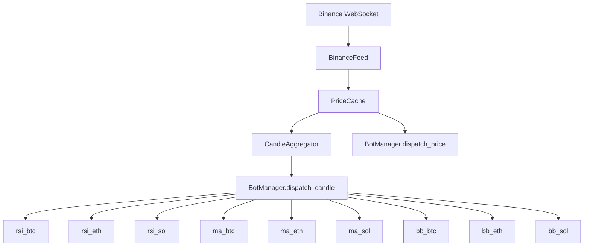

# Strategy Tuning & New Bot Plan

## Overview

- **3 strategies** × **3 coins** (BTCUSDT, ETHUSDT, SOLUSDT) = **9 bot instances**
- All operate on 1-minute candles from CandleAggregator
- Each bot gets its own 10K USDT virtual portfolio
- Dashboard sidebar shows: `rsi_btc`, `rsi_eth`, `rsi_sol`, `ma_btc`, `ma_eth`, `ma_sol`, `bb_btc`, `bb_eth`, `bb_sol`

---

## 1. Multi-Coin Factory Pattern

**Problem**: `name` and `symbol` are class-level attributes on BaseStrategy. We need 3 instances of each strategy — one per coin — each with a unique `name`.

**Solution**: Add a `for_symbol()` classmethod to each strategy that dynamically creates a subclass:

```python
@classmethod
def for_symbol(cls, symbol: str) -> type:
    asset = symbol.replace("USDT", "").lower()
    return type(
        f"{cls.__name__}_{asset.upper()}",
        (cls,),
        {"name": f"rsi_{asset}", "symbol": symbol},
    )
```

**Registration in main.py**:
```python
SYMBOLS = ["BTCUSDT", "ETHUSDT", "SOLUSDT"]
REGISTERED_BOTS = []
for sym in SYMBOLS:
    REGISTERED_BOTS.append(RSIBot.for_symbol(sym))
    REGISTERED_BOTS.append(MACrossoverBot.for_symbol(sym))
    REGISTERED_BOTS.append(BollingerBot.for_symbol(sym))
```

**Files touched**: Each strategy file + `main.py`

---

## 2. Tuned RSI Bot — `strategies/example_rsi_bot.py`

### Current Problems
| Issue | Current | Impact |
|-------|---------|--------|
| SMA-based RSI | `sum(gains)/period` | Very noisy on 1-min |
| Thresholds 30/70 | Too tight for 1-min | Rarely triggers — RSI stays 40–60 |
| No trend filter | Buys in freefall | Catches falling knives |
| No cooldown | Back-to-back trades | Burns fees on whipsaw |
| 95% trade fraction | Nearly all-in | One bad trade = wrecked |
| No smoothing memory | Recomputes from scratch | Slow + unstable |

### Redesign

**Wilder's Exponential RSI** — maintains running `avg_gain` / `avg_loss` across candles:
```
alpha = 1 / period
avg_gain = alpha * current_gain + (1 - alpha) * prev_avg_gain
avg_loss = alpha * current_loss + (1 - alpha) * prev_avg_loss
RS = avg_gain / avg_loss
RSI = 100 - 100 / (1 + RS)
```

**Parameter Changes**:
| Parameter | Old | New | Why |
|-----------|-----|-----|-----|
| RSI_PERIOD | 14 | 14 | Standard, fine for 1-min with Wilder |
| OVERSOLD | 30 | 25 | Wider threshold for 1-min noise |
| OVERBOUGHT | 70 | 75 | Wider threshold for 1-min noise |
| TRADE_FRACTION | 0.95 | 0.50 | Half-in, preserve capital |
| COOLDOWN_CANDLES | N/A | 5 | Min 5 candles between trades |
| TREND_EMA_PERIOD | N/A | 50 | 50-candle EMA trend filter |

**New Signal Logic**:
- Maintain EMA(50) of close prices as trend line
- **BUY**: RSI < 25 AND close > EMA(50) AND cooldown elapsed → buying dips in uptrend only
- **SELL**: RSI > 75 AND in position AND cooldown elapsed

**Data Flow**:
```
on_candle():
  1. Append close to rolling deque (period+1)
  2. Update Wilder avg_gain / avg_loss (exponential)
  3. Update trend EMA(50)
  4. If warmup complete: check signals with cooldown gate
```

---

## 3. Tuned MA Crossover Bot → MACD Bot — `strategies/example_ma_crossover.py`

### Current Problems
| Issue | Current | Impact |
|-------|---------|--------|
| EMA(9/21) too short | 9 and 21 minutes | Constant whipsaw |
| No strength filter | Any crossover fires | Flat market = many false signals |
| No momentum confirmation | Pure crossover | Enters weak moves |
| 95% trade fraction | All-in | Wrecked by one bad trade |

### Redesign — Full MACD Strategy

Standard MACD uses EMA(12) and EMA(26) with a 9-period signal line. This is a proven framework that naturally filters weak crossovers via the histogram.

**Parameter Changes**:
| Parameter | Old | New | Why |
|-----------|-----|-----|-----|
| FAST_PERIOD | 9 | 12 | MACD standard |
| SLOW_PERIOD | 21 | 26 | MACD standard |
| SIGNAL_PERIOD | N/A | 9 | MACD signal line |
| TRADE_FRACTION | 0.95 | 0.50 | Half-in per trade |
| MIN_HIST | N/A | dynamic | Min histogram threshold |

**New Indicators**:
- `macd_line = EMA(12) - EMA(26)`
- `signal_line = EMA(9) of macd_line`
- `histogram = macd_line - signal_line`

**New Signal Logic**:
- **BUY**: MACD crosses above Signal AND `histogram > 0` AND not in position
  - The histogram > 0 filter ensures the crossover has momentum, not just a flicker
- **SELL**: MACD crosses below Signal AND `histogram < 0` AND in position
- **Dead zone filter**: Skip signals when `abs(macd_line) < price * 0.00005` — EMAs too close, flat market

**Data Flow**:
```
on_candle():
  1. Increment candle count, append close
  2. If warmup (26 candles): seed slow EMA, fast EMA, MACD, signal
  3. Else: update EMAs → MACD → signal → histogram
  4. Detect MACD/Signal crossover + histogram check
  5. Fire order if conditions met
```

---

## 4. NEW: Bollinger Band Mean Reversion Bot — `strategies/bollinger_bot.py`

### Why Bollinger Bands for 1-Min Charts

1-minute price action is **highly mean-reverting** — price tends to snap back to the moving average after spikes. Bollinger Bands measure this precisely:
- Middle band = SMA(period) — the mean
- Upper band = SMA + K × stddev — overbought boundary
- Lower band = SMA - K × stddev — oversold boundary
- Bands **auto-adapt to volatility** — no per-coin tuning needed

### Parameters
| Parameter | Value | Why |
|-----------|-------|-----|
| BB_PERIOD | 20 | Standard BB lookback |
| BB_STD_DEV | 2.0 | Standard deviation multiplier |
| TRADE_FRACTION | 0.50 | Half-in per trade |
| EXIT_AT_MIDDLE | True | Take profit at SMA, not upper band |
| MIN_BANDWIDTH | 0.001 | Skip during squeeze (bands < 0.1% of price) |
| COOLDOWN_CANDLES | 3 | Min candles between trades |

### Indicators
```
sma = mean(closes[-period:])
stddev = std(closes[-period:])
upper = sma + K * stddev
lower = sma - K * stddev
pct_b = (close - lower) / (upper - lower)   # 0 = lower band, 1 = upper band
bandwidth = (upper - lower) / sma            # volatility measure
```

### Signal Logic
- **BUY**: `close < lower_band` AND `bandwidth > MIN_BANDWIDTH` AND not in position AND cooldown OK
  - Price has fallen below the statistical lower bound → expect reversion to mean
- **SELL (profit)**: `close > sma` AND in position → exiting at the mean (conservative, high win-rate)
- **SELL (stop)**: `close < lower_band * 0.995` AND in position → 0.5% below entry band = cut losses

### Data Flow
```
on_candle():
  1. Append close to deque(maxlen=period)
  2. If len < period: warming up, return
  3. Compute SMA, stddev, upper, lower, %B, bandwidth
  4. Check bandwidth filter (skip squeeze)
  5. Check signals with cooldown gate
```

### Why This Works on All 3 Coins Without Tuning
- BTC: Lower 1-min volatility → narrower bands → fewer but higher-quality signals
- ETH: Medium volatility → moderate signal frequency
- SOL: High volatility → wider bands → more signals, larger moves

---

## 5. Architecture: Data Flow with 9 Bots



Each bot only receives candles matching its `symbol`. The `dispatch_candle()` method in BotManager already filters: `if bot.symbol == candle.symbol`.

**WebSocket streams**: `btcusdt@aggTrade`, `ethusdt@aggTrade`, `solusdt@aggTrade` — all on a single combined stream connection (already supported by BinanceFeed).

---

## 6. Files to Create / Modify

### New Files
| File | Description |
|------|-------------|
| `strategies/bollinger_bot.py` | Bollinger Band Mean Reversion strategy |

### Modified Files
| File | Changes |
|------|---------|
| `strategies/example_rsi_bot.py` | Wilder RSI, trend EMA filter, cooldown, trade fraction, `for_symbol()` factory |
| `strategies/example_ma_crossover.py` | MACD logic, signal line, histogram filter, dead zone, `for_symbol()` factory |
| `main.py` | Register 9 bots: 3 strategies × 3 symbols, add SOLUSDT to feeds |

### No Changes Needed
| File | Why |
|------|-----|
| `core/base_strategy.py` | `on_candle()` interface unchanged |
| `core/bot_manager.py` | Already handles N bots, filters by symbol |
| `core/simulation_engine.py` | Already handles N portfolios, per-bot fee rates |
| `data/binance_feed.py` | Already supports multi-symbol WebSocket |
| `data/candle_aggregator.py` | Already builds candles per-symbol |
| `db/*` | Schema unchanged |
| `api/*` | API/dashboard already dynamic |
| `config.py` | 10K USDT default per bot is fine |

---

## 7. Dashboard Impact

The sidebar will show 9 bots. Each has its own chart with portfolio value + coin price overlay. No dashboard code changes needed — the existing dynamic bot list and chart rendering handle any number of bots.

Naming convention for clarity:
- `rsi_btc`, `rsi_eth`, `rsi_sol`
- `ma_btc`, `ma_eth`, `ma_sol`
- `bb_btc`, `bb_eth`, `bb_sol`

---

## 8. Delete Old DB

Since we are completely changing bot names and strategies, the old `trade_platform.db` should be deleted before first run to avoid stale data from old bot names.
